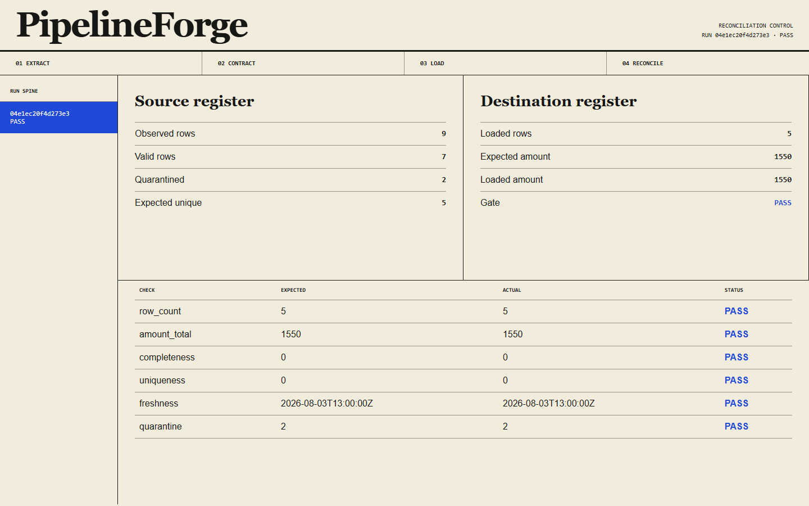

# PipelineForge

PipelineForge moves changing SQL, REST, CSV, JSONL, and Parquet data into
DuckDB or PostgreSQL and produces an auditable reconciliation gate.

It handles:

- SQL incremental merge and repeat-run stability;
- bearer-authenticated, cursor-paginated REST ingestion, watermarks, rolling
  late-data restatement, rate-limit recovery, and additive schema evolution;
- checksummed AdapterProof mappings, typed quarantine, CSV/JSONL/Parquet
  migration, and DuckDB/PostgreSQL loading;
- row/amount/completeness/uniqueness/freshness reconciliation with JSON, HTML,
  and a read-only run inspector;
- checksummed DeliveryGuard retries, dead letters, cycle-2 replay, duplicate
  suppression, payload-conflict refusal, and redacted alert events;
- a scheduler-neutral CLI plus a parsed Airflow 3 DAG.



[Open the live run inspector](https://sutasmantas.github.io/data-pipeline-reconciliation/)

## Quickstart

```powershell
py -3.11 -m venv .venv
.\.venv\Scripts\python -m pip install vendor\adapterproof-0.2.0-py3-none-any.whl vendor\deliveryguard-0.2.0-py3-none-any.whl
.\.venv\Scripts\python -m pip install -e ".[test]"
.\.venv\Scripts\pipelineforge migrate-files --work-dir .pipelineforge
.\.venv\Scripts\pipelineforge serve --evidence-dir .pipelineforge\evidence
```

Open `http://127.0.0.1:8080`. The fixed run needs no external credentials and
ends at `PASS` with 5 destination rows, amount 1550, and 2 quarantined records.

## Verification

```powershell
.\.venv\Scripts\python -m ruff check .
.\.venv\Scripts\python -m mypy
.\.venv\Scripts\python -m pytest --cov=pipelineforge
.\.venv\Scripts\python -m build
.\.venv\Scripts\python -m twine check dist\*
docker build -t pipelineforge:local .
```

See [the runbook](docs/RUNBOOK.md) and
[architecture](docs/ARCHITECTURE.md) for adaptation points and operating
details.
